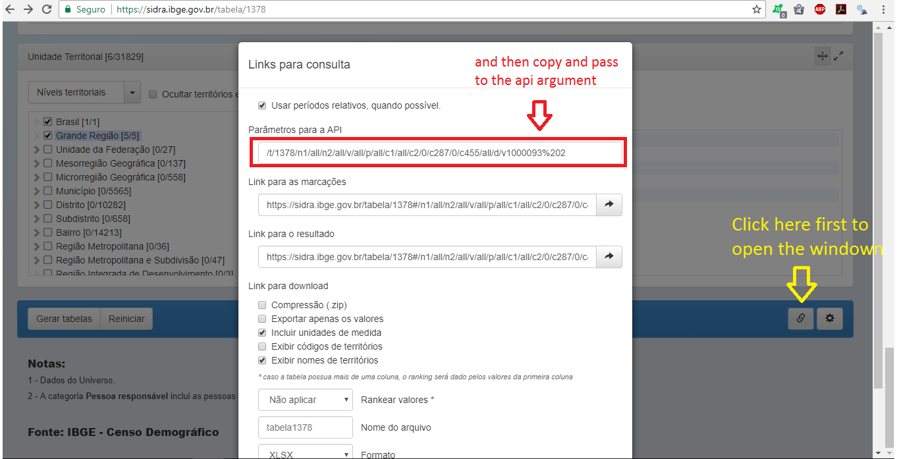
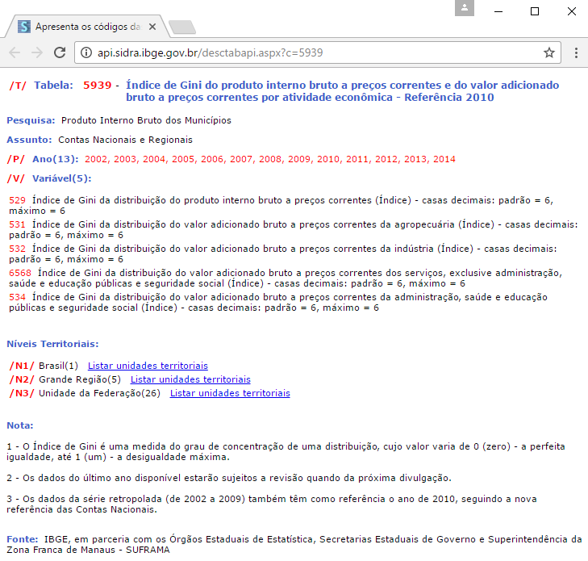

```{r setup, include=FALSE}
knitr::opts_chunk$set(echo = TRUE, collapse = TRUE, comment = "#>")
```


## R Interface to the SIDRA's API

The "sidrar" R package seeks to provide direct access to the data of SIDRA - Sistema IBGE de Recuperação Automática - within the R environment in an easy and flexible way.

## Installation

To install the version available on CRAN:

```{r, eval=FALSE}
install.packages("sidrar")
```

To install the development version hosted on Github:

```{r, eval=FALSE}
library(devtools)
install_github("rpradosiqueira/sidrar")
```

## Functions

For the time being, the "sidra" package contains only three functions:

```{r, eval=FALSE}
get_sidra          It recovers data from the given table
                   according to the parameters

info_sidra         It allows you to check what parameters
                   are available for a table via an web browser
                   
search_sidra       It searches which tables have a particular 
                   word in their names
```		   

## Examples
### get_sidra

1) Let's assume that we want the IPCA (Índice de Preços ao Consumidor Amplo) for the city of Campo Grande/MS. However, we will only recover the overall percentage rate in the last 12 months. To do this simply execute:

```{r, eval = FALSE}
library(sidrar)

get_sidra(x = 1419,
          variable = 63,
          period = c("last" = 12),
          geo = "City",
          geo.filter = 5002407,
          classific = "c315",
          category = list(7169),
          header = FALSE,
          format = 3)

```

```{r, echo = FALSE, eval=FALSE}
## Tabela obtida
library(sidrar)

get_sidra(x = 1419,
          variable = 63,
          period = c(last = "12"),
          geo = "City",
          geo.filter = 5002704,
          classific = "c315",
          category = list(7169),
          header = FALSE,
          format = 3)

```

<p> <br> </p>

2) In this example we will download the Gini index data for the 2014 GDP of the states, containing only the codes in the table (format = 1):

```{r, eval = FALSE}
get_sidra(x = 5939,
          variable = 529,
          period = "2014",
          geo = "State",
          header = TRUE,
          format = 1)

```

```{r, echo = FALSE, eval=FALSE}
get_sidra(x = 5939,
          variable = 529,
          period = "2014",
          geo = "State",
          header = TRUE,
          format = 1)

```

<p> <br> </p>

3) Finally, if you want to put the parameters of the API directly, just execute:

```{r, eval = FALSE}
get_sidra(api = "/t/5938/n3/all/v/37/p/last%201/d/v37%200")

```

```{r, echo = FALSE, eval=FALSE}
get_sidra(api = "/t/5938/n3/all/v/37/p/last%201/d/v37%200")

```

<p> <br> </p>

For most users the data request is done via the online portal (<https://sidra.ibge.gov.br>). In this case, if you want to save the parameters of the table selected in the portal to a posterior request of the same table via **sidrar**, you should copy the path in the red rectangle and pass to the *api* argument in get_sidra:         

<p> <br> </p>



-------

### info_sidra

In the previous examples we know how to recover data from tables according to the parameters reported. However, if I do not know what the parameters are, how should I proceed? To verify the parameters (variables, classifications, periods, etc.) of a given table, simply use the function "info_sidra", informing the code of the table. The function returns a list with the possible parameters in the console. However, if wb = TRUE, the user can allow the result to be displayed in an web browser.

```{r, echo = FALSE, eval=FALSE}
info_sidra(5939)
```

if **wb = TRUE**:

```{r, eval=FALSE}
info_sidra(5939, wb = TRUE)
```

```{r, echo=FALSE, error=TRUE}
cat("Can the web browser be open? (y/n): ")
```

By placing **y**, we have in this example:



-------

### search_sidra

If the user wants to know if there is a table that contains a certain term / word, simply use the function ** search_sidra ** informing the words of interest. The function returns the tables containing these terms in their headings.

```{r, eval=FALSE}
search_sidra(c("gini"))
```
